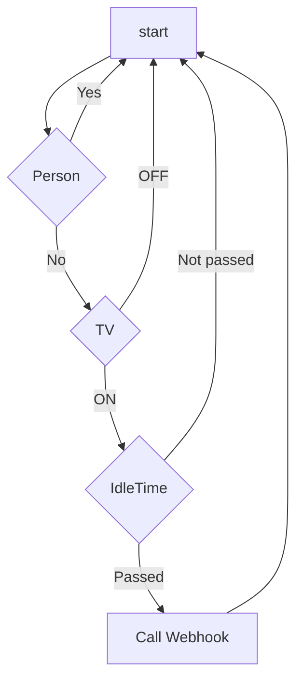

# Pipeless Agent for TV automation

This agent turns off the TV when nobody is watching it.

This agent works along with the Pipeless Agent Home Assistant Integration.

See the complete tutorial at: LINK VIDEO HERE

## Logic of the agent

